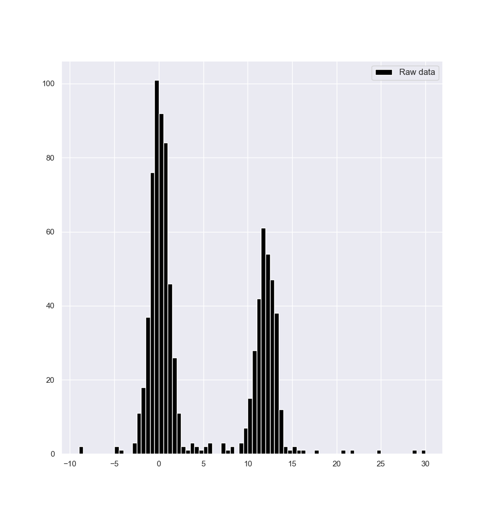
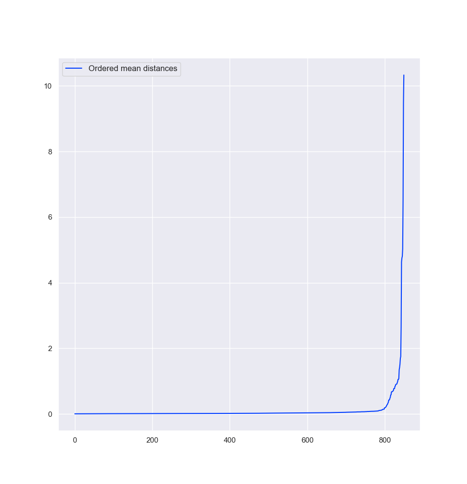
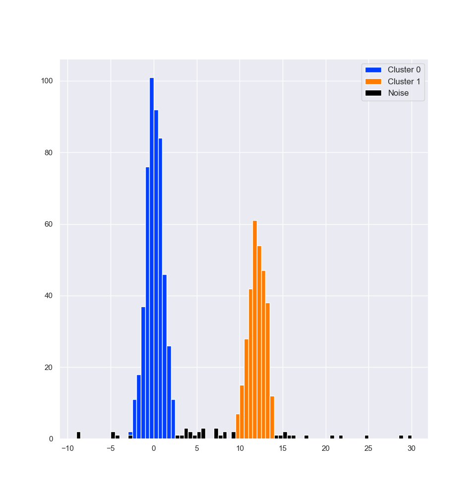
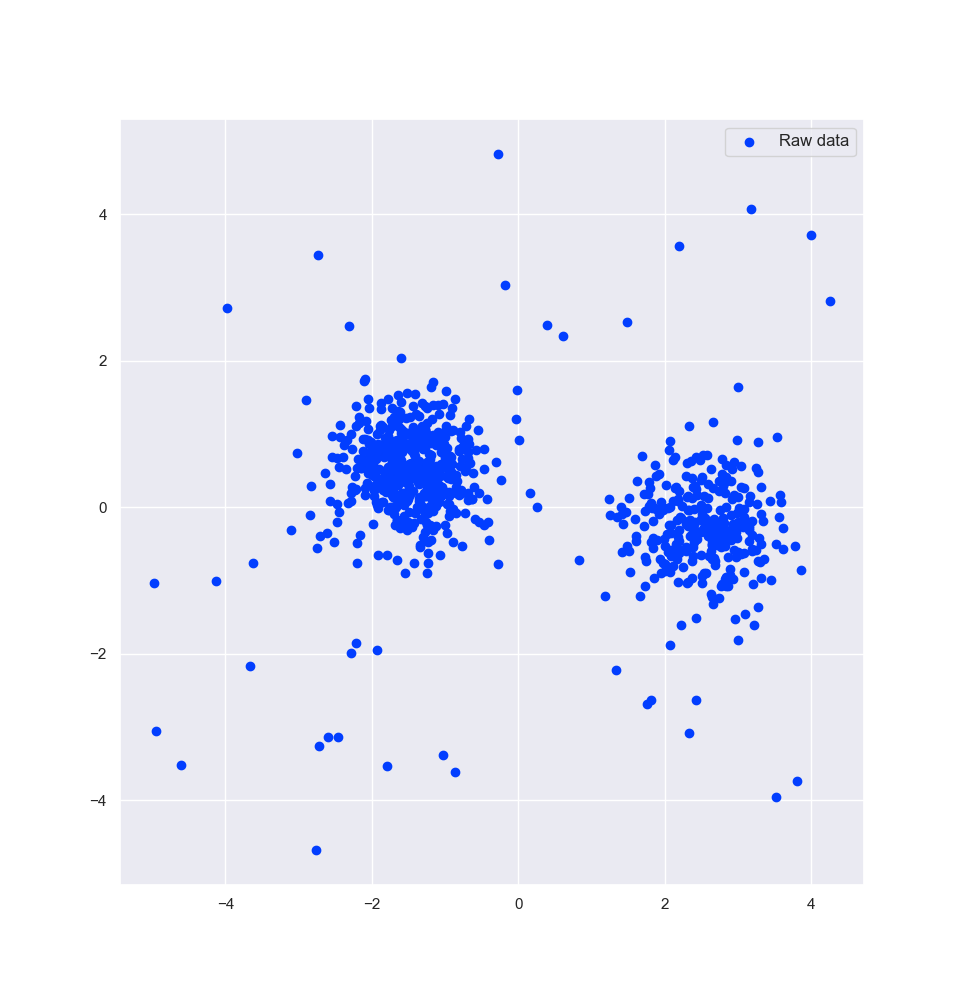
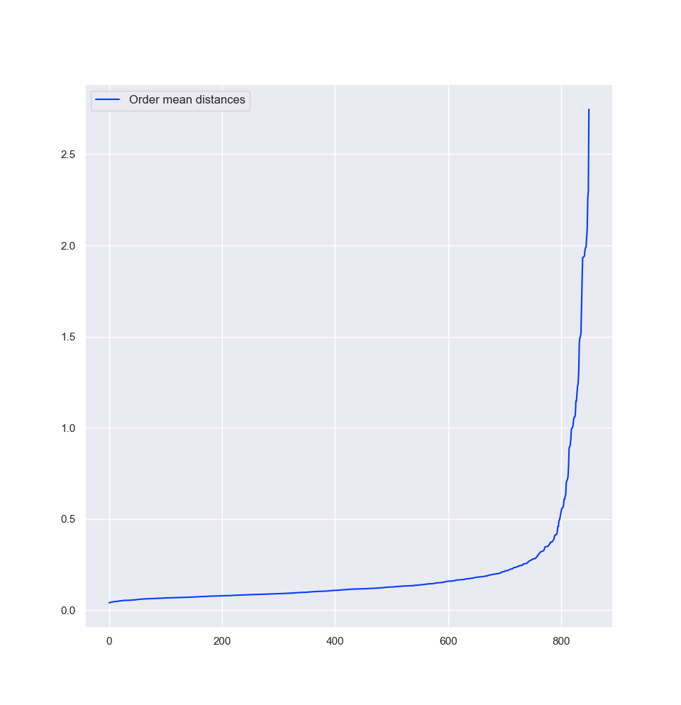
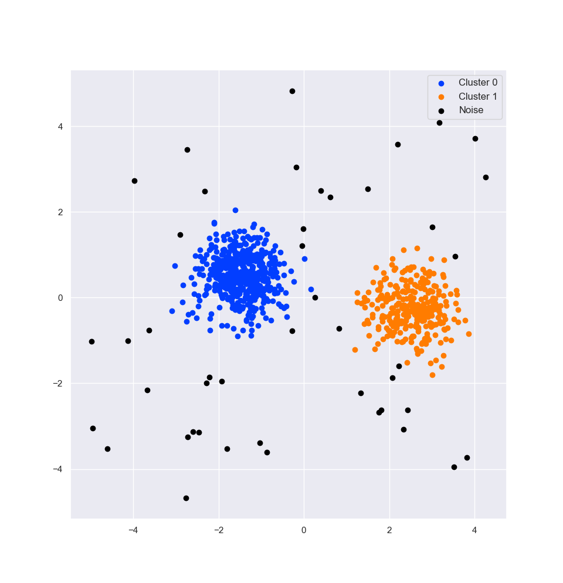

## [DBSCAN](https://en.wikipedia.org/wiki/DBSCAN)

DBSCAN is a density-based clustering algorithm which takes in two parameters: `eps` and `min_samples`.
Loosely, two points are part of the same cluster if they are "in the neighborhood" of or are "connected" through `min_samples` other points.
The parameter `eps` is the maximum distance between two points for them to be considered connected.
(For a more technical definition, just take a look at the Wikipedia page linked above; the algorithm is fairly straightfoward.)

### Hyper parameter selection

The choice of these parameters isn't immediately obvious, but generally, if the data set has more samples or has higher dimensions, then `min_samples` should be larger.
Selecting `min_samples` might be fairly ad hoc.

On the other hand, `eps` could be chosen using a k-nearest neighbors approach:
1. Choose `min_samples`.
2. Perform kNN where *k* is equal to `min_samples`.
3. For each point, calculate the mean distance between its neighbors.
4. Sort and plot these distances.
5. A good choice of `eps` will be where these distances begin increasing a lot, around some elbow.

### Results

The algorithm is used on two simulated data sets, each with two distinct clusters and some outliers.

