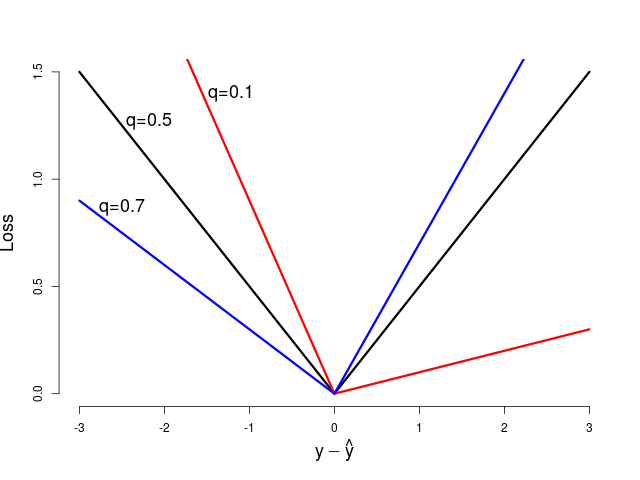
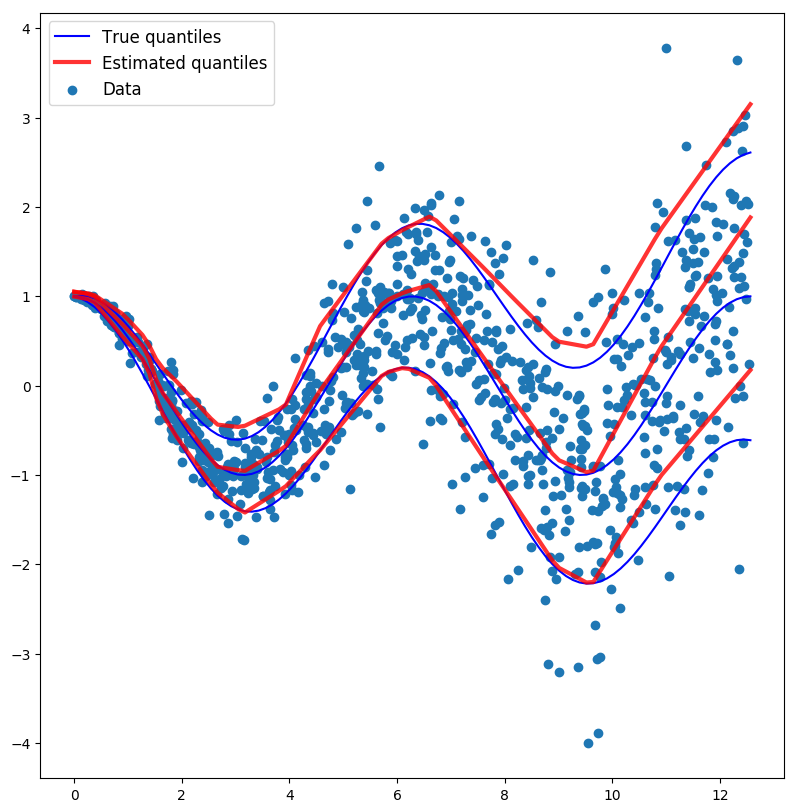

## Quantile regression with a neural network

The model can be found in the `neuralnet.py` file.
As of this writing, the virtual environment used was the same as that in the autoencoder example.

### Loss function

Doing quantile regression with a neural network is as easy as choosing the appropriate loss function. The loss function for quantile *q* of a single point can be expressed as

<a href="https://www.codecogs.com/eqnedit.php?latex=\begin{align*}&space;L_q(y,&space;\hat{y})&space;=&space;(y-\hat{y})(q-1_{(y-\hat{y}<0)})&space;&=&space;\begin{cases}&space;q&space;|y-\hat{y}|&space;&&space;\mathrm{if}&space;\;&space;y-\hat{y}&space;\ge&space;0&space;\\&space;(1&space;-&space;q)&space;|y-\hat{y}|&space;&&space;\mathrm{if}&space;\;&space;y-\hat{y}&space;<&space;0)&space;\end{cases}&space;\\&space;&=&space;\max\left\{q(y-\hat{y}),&space;-(1-q)(y-\hat{y})&space;\right\}&space;\end{align*}" target="_blank"></a>

where *y* is the true response label and <a href="https://www.codecogs.com/eqnedit.php?latex=\inline&space;\hat{y}" target="_blank"></a> is the estimated quantile.

Here is an image of the loss function for several quantiles.
Notice for *q=0.1* that we are punished more for overestimating the truth (the negative side) than underestimating (the positive side).
And the opposite is true for *q=0.7*.



This function can be implemented in Python with:

```python
from keras import backend as K
import numpy as np

def make_quantile(q):
    q = np.array(q)
    def loss(y_true, y_pred):
        e = y_true - y_pred
        return K.mean(K.maximum(q*e, (q-1)*e), axis = -1) 
    return loss
```

which can take in a list of quantiles and will return a length-*q* loss function, allowing us to model several quantiles concurrently.

Some references:
- [A helpful stack exchange question](https://stats.stackexchange.com/questions/251600/quantile-regression-loss-function/252029)
- [Deep quantile regression](https://towardsdatascience.com/deep-quantile-regression-c85481548b5a) (which helped me get started on this and notes the equivalence with the asymmetric Laplace likelihood)


### Results

Executing the `neuralnet.py` script yields the following the image.
The plot shows the data, the true quantiles (based on the normal distributioned), and the estimate quantiles (from the model).
Notice that the model is able to pick up the heteroscedasticity in the data.



### Comments

- The model seems to perform better with fewer hidden layers and fewer neurons. This may not hold true with more complicated data structures.
- It seemed a lot of epochs were necessary.
- The quality of the model may be difficult to assess in higher dimensions. If the underlying distribution is known (like the normal in the case of the example), you can compare the theoretical quantiles to the estimated quantiles.
- An observed versus fitted plot may also be helpful in assessing the quality of the estimated quantiles. If the model is a good fit, the percentage of data points lying within the two outer bounds should roughly equal the difference of the two quantiles. So in the example, our outer quantiles are 0.1 and 0.9, so 80% of the data points should fall within our estimated quantiles (the percentage was 80.4%). This is called coverage.
