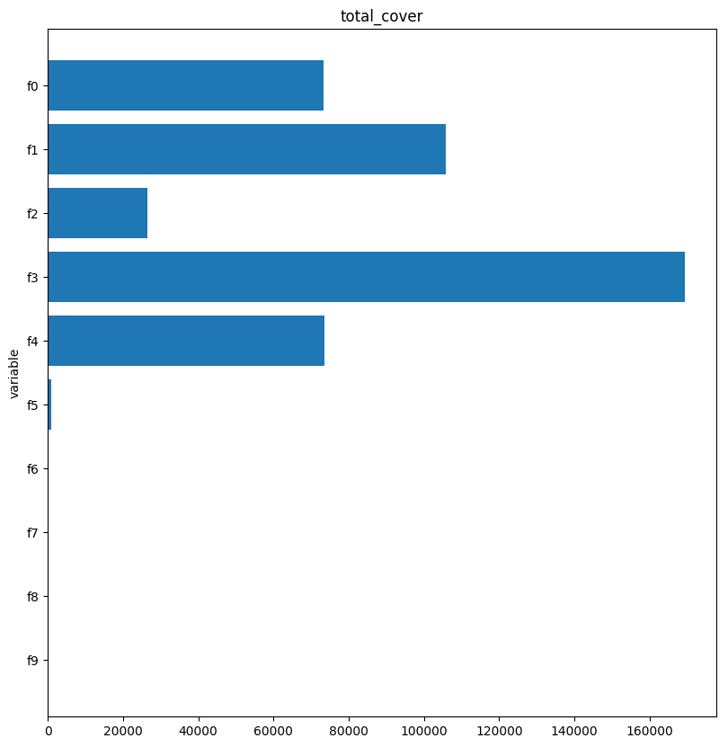

## XGBoost (eXtreme Gradient Boosting)

This is a simple example for implementing the [XGBoost](https://en.wikipedia.org/wiki/XGBoost) algorithm.
Anyone familiar with [random forests](https://en.wikipedia.org/wiki/Random_forest) will be at home with XGBoost.

The algorithm boasts at least three important positive features:
- Strong performance on non-linear regression and classification problems
- Inexpensive computation (far superior to random forests)
- Useful inference in the form of importance measures

One of the only downsides to the algorithm is hyperparameter selection.
There are a handful of parameters which can be tuned to optimize the algorithm's performance, and this can get very tedious, very quickly.
Fortunately, the default values usually work well enough, and there are some tools (namely, [Amazon SageMaker](https://aws.amazon.com/sagemaker/)) which can handle automatic selection of hyperparameters by optimizing some specified criteria.

[XGBoost Documentation](https://xgboost.readthedocs.io/en/latest/).

A recommended alternative to XGBoost is Microsoft's [LightGBM](https://github.com/Microsoft/LightGBM).

### Simulated example

#### Data

We simulate *n=10000* data points with *k=10* features, the first five of which make an explicit appearance in the non-linear response (see `code.py` for details).
Training the model takes only a second or two.
We make predictions a test set of size *m=1000* and will see that the model can handle this just fine.
We will also see, by the variable importance plots, the last five variables had no influence on the response.

#### Results

This is a plot of the test set predictions.
The optimal plot would have points fall along the line *y=x*.

The remaining plots all show some measure of variable importance.
Taken together (whatever that means) would suggest we keep the first five variables, but discard the last five.

